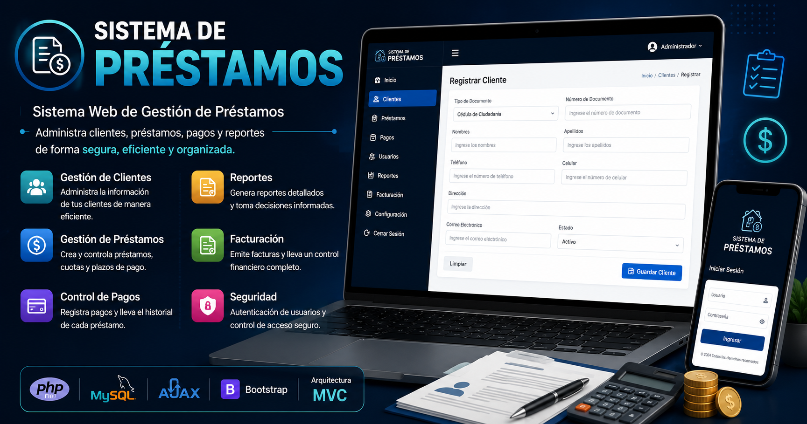
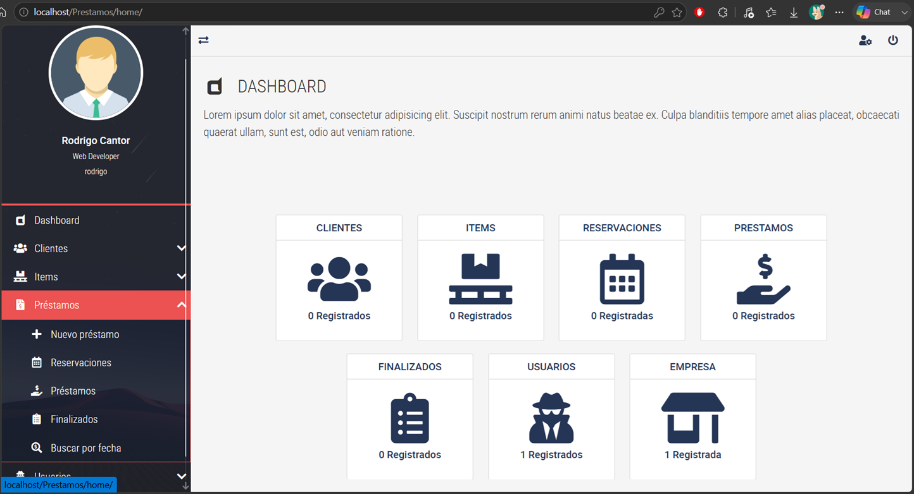

# Loan Management System - Sistema Web de Gestión de Préstamos 


---

# 📖 Descripción

**Loan Management System** es un sistema web desarrollado con **PHP**, **MySQL/MariaDB** y arquitectura **Modelo-Vista-Controlador (MVC)**, diseñado para facilitar la administración y control de préstamos.

La aplicación permite gestionar usuarios, clientes, ítems/inventario, préstamos, cuotas y pagos, centralizando la información dentro de una plataforma organizada que ayuda a mejorar el seguimiento de las operaciones y reducir procesos manuales.

El sistema cuenta con autenticación de usuarios, manejo de sesiones, roles y privilegios, validaciones de formularios, operaciones CRUD, consultas seguras mediante **PDO**, comunicación dinámica utilizando **AJAX** y generación de comprobantes en **PDF**, proporcionando una estructura modular, segura y fácil de mantener.

---

# 🖼️ Vista previa



---

# ✨ Características principales

- 🔐 Sistema de autenticación de usuarios con manejo de sesiones.
- 🛡️ Roles y niveles de privilegio por usuario.
- 👥 Administración de clientes.
- 📦 Gestión de inventario/ítems.
- 💰 Gestión y seguimiento de préstamos (reservas, préstamos activos y finalizados).
- 📅 Control de cuotas.
- 💵 Registro y seguimiento de pagos.
- 🧾 Generación de comprobantes/facturas en PDF (FPDF).
- ⚡ Operaciones dinámicas mediante AJAX.
- 🏗 Arquitectura MVC.
- 🗄 Gestión de información mediante MySQL/MariaDB.
- 🔒 Validaciones del lado del servidor.
- 🔐 Consultas seguras utilizando PDO (sentencias preparadas).
- 📱 Interfaz adaptable a diferentes dispositivos.
- 📂 Código organizado, modular y escalable.

---

# 📂 Estructura del proyecto

```text
Prestamos/
│
├── ajax/                  # Puntos de entrada AJAX (uno por módulo)
├── config/                # Configuración general y conexión a la BD
├── controladores/         # Controladores de la arquitectura MVC
├── modelos/                # Acceso y gestión de datos (PDO)
├── facturas/               # Generación de comprobantes en PDF (FPDF)
├── vistas/
│   ├── contenidos/         # Vistas parciales por módulo (listar, crear, buscar, editar)
│   ├── inc/                 # Includes comunes (NavBar, NavLateral, Scripts, LogOut)
│   ├── css/                 # Hojas de estilo (Bootstrap, Bootstrap Material Design, etc.)
│   ├── js/                  # Scripts (jQuery, SweetAlert2, main.js)
│   ├── webfonts/             # Íconos (Font Awesome) y tipografías
│   ├── assets/               # Imágenes, avatares e íconos
│   └── plantilla.php          # Plantilla/layout principal
│
├── prestamos.sql          # Script de creación de la base de datos
├── .htaccess               # Configuración del servidor Apache (URLs amigables)
├── index.php                # Punto de entrada de la aplicación
└── README.md
```

---

# 💻 Tecnologías utilizadas

## Backend

- PHP
- MySQL / MariaDB
- PDO (sentencias preparadas)
- FPDF (generación de comprobantes en PDF)

## Frontend

- HTML5
- CSS3
- JavaScript
- AJAX
- Bootstrap + Bootstrap Material Design
- jQuery
- SweetAlert2 (alertas)
- Font Awesome (iconografía)

## Arquitectura

- MVC (Modelo - Vista - Controlador)

---

# ⚙️ Funcionalidades del sistema

✔ Inicio de sesión y autenticación de usuarios.

✔ Gestión de usuarios y niveles de privilegio.

✔ Administración de clientes.

✔ Gestión de inventario/ítems.

✔ Registro y administración de préstamos.

✔ Control de cuotas.

✔ Registro y seguimiento de pagos.

✔ Generación de comprobantes en PDF.

✔ Consulta del historial de préstamos.

✔ Configuración de la empresa.

✔ Validación de formularios.

✔ Conexión segura con base de datos mediante PDO.

---

# ⚙️ Requisitos

- PHP 7.4 o superior.
- MySQL 5.7 o superior (o MariaDB 10.4+).
- Apache con `mod_rewrite` habilitado (XAMPP, WAMP o Laragon).
- Navegador web moderno.

---

# 🚀 Instalación

## 1. Clonar el repositorio

```bash
git clone https://github.com/rcvunicun-lgtm/Prestamos.git
```

---

## 2. Configurar servidor local

Copiar la carpeta del proyecto dentro del servidor web.

Ejemplo utilizando XAMPP:

```text
xampp/htdocs/Prestamos
```

---

## 3. Crear la base de datos

Crear una base de datos llamada:

```text
prestamos
```

Después importar el archivo:

```text
prestamos.sql
```

---

## 4. Configurar conexión a la base de datos

Editar el archivo:

```php
config/SERVER.php
```

Modificar los valores de conexión:

```php
SERVER
DB
USER
PASS
```

según la configuración del entorno local.

---

## 5. Ejecutar la aplicación

Abre tu navegador web e ingresa a la siguiente ruta: `http://localhost/TiendaVirtual` <br>
Usuario de prueba: `rodrigo` / Clave: `12345678`

---

# 🧠 Arquitectura del proyecto

El sistema utiliza el patrón arquitectónico **MVC (Modelo-Vista-Controlador)**, permitiendo separar la lógica de negocio, la interfaz del usuario y la comunicación con la base de datos.

```text
Usuario
   │
   ▼
Vista
   │
   ▼
AJAX
   │
   ▼
Controlador
   │
   ▼
Modelo
   │
   ▼
Base de Datos
```

Esta estructura facilita el mantenimiento del código, mejora la organización del proyecto y permite realizar futuras ampliaciones de manera más sencilla.

---

# 🎯 Objetivos del proyecto

- Digitalizar la gestión de préstamos.
- Centralizar la información de clientes y operaciones financieras.
- Facilitar el control de pagos y cuotas.
- Reducir procesos administrativos manuales.
- Aplicar buenas prácticas utilizando arquitectura MVC.

---

# 🧠 Conocimientos aplicados

Durante el desarrollo del proyecto fortalecí conocimientos en:

- Desarrollo backend utilizando PHP.
- Diseño y administración de bases de datos MySQL/MariaDB.
- Consultas preparadas mediante PDO.
- Desarrollo de operaciones CRUD.
- Arquitectura MVC.
- Manejo de sesiones, autenticación y roles de usuario.
- Comunicación asíncrona con AJAX.
- Generación de documentos PDF desde PHP.
- Organización y estructuración de proyectos web.
- Separación de responsabilidades.
- Buenas prácticas de programación.

---

# 🚀 Mejoras futuras

- Dashboard con estadísticas de préstamos.
- Exportación de información a Excel.
- Sistema de notificaciones.
- Recordatorios automáticos de pagos.
- Registro de auditoría de movimientos.
- API REST para integración con aplicaciones móviles.
- Sistema avanzado de permisos por roles.
- Panel administrativo con gráficos.

---

# 👨‍💻 Autor

**Rodrigo Cantor Vasquez**

Ingeniero de Sistemas

GitHub:

https://github.com/rcvunicun-lgtm

---

# ⭐ Si este proyecto te resulta útil...

No olvides darle una ⭐ al repositorio.